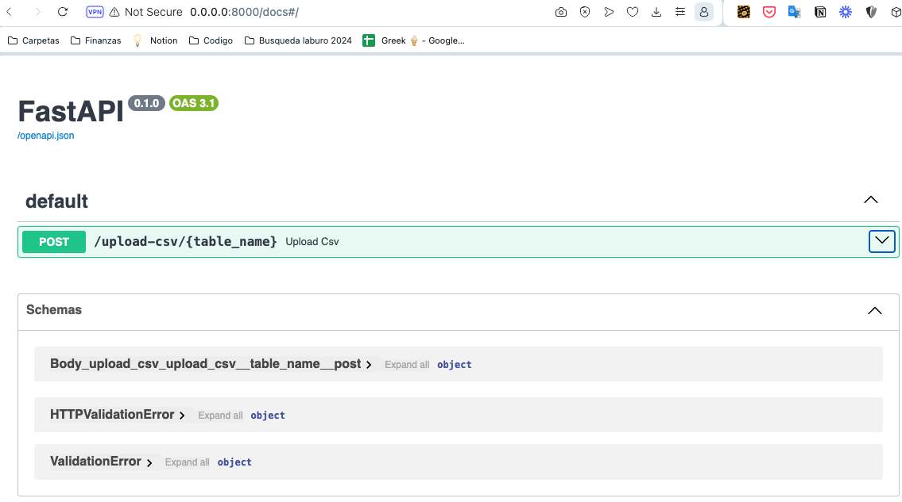

# DB Migration and Analysis API

## Project Overview
This project implements a REST API for migrating historical data from CSV files into a SQL database. It supports batch data insertion for efficient data handling. The API is designed to handle three different tables: `departments`, `jobs`, and `employees`.

## Technologies Used
- FastAPI: For the REST API server.
- PostgreSQL: As the SQL database for data storage.
- Docker: For containerization and easy deployment.
- psql: PostgreSQL's interactive terminal for database interaction.

## Getting Started

### Prerequisites
- Docker installed on your machine
- psql (PostgreSQL terminal) installed for database interactions

### Setup and Local Deployment
1. **Clone the Repository**
   ```bash
   git clone https://github.com/codarosantiago/db-migration-and-analysis.git
   cd db-migration-and-analysis
   ```
2. **Set env variables**
   Create a `.env` file and set the PostgreSQL password:
   ```document
   POSTGRES_PASSWORD=jklh395bnm
   ``` 

3. **Start the Application**
   Use Docker to build and run the application:
   ```bash
   docker-compose up --build
   ```

4. **Access the Database**
   Connect to the PostgreSQL database using psql:
   ```bash
   psql -h localhost -p 5433 -U fastapi -d mydatabase
   ```
   Enter the password when prompted.

5. **Verify Database Setup**
   Check if the tables are correctly set up and initially empty:
   ```sql
   SELECT * FROM jobs;
   ```

### Using the API
Access the API documentation and interact with it via:
```
0.0.0.0:8000/docs
```
Here, you can upload CSV files in `input_files` folder corresponding to the `departments`, `jobs`, and `employees` tables and perform batch inserts.


## Features
- **CSV File Upload**: Upload historical data from CSV files directly via the API.
- **Batch Inserts**: The API supports inserting between 1 and 1000 rows in a single request to efficiently populate the database.
- **Data Validation**: Ensures that only valid data is entered into the database through comprehensive schema checks.


